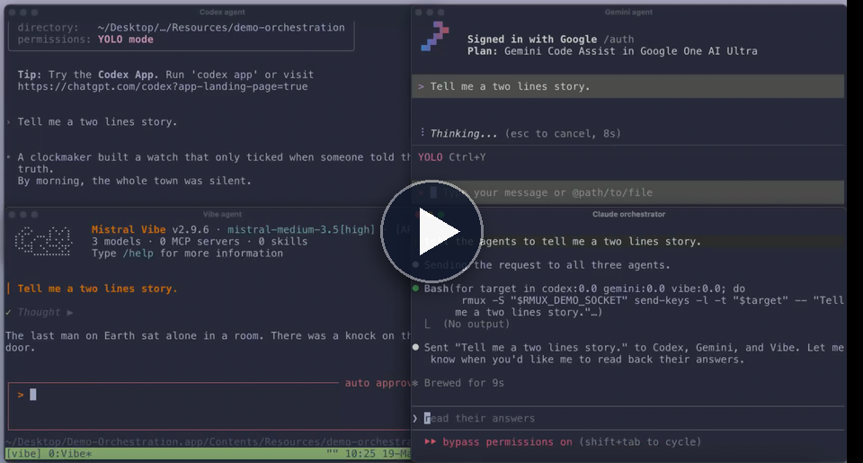
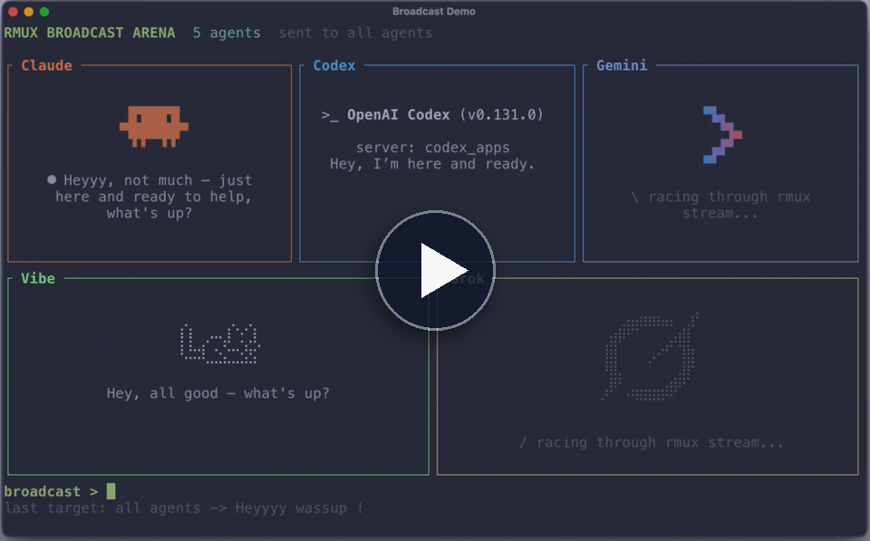
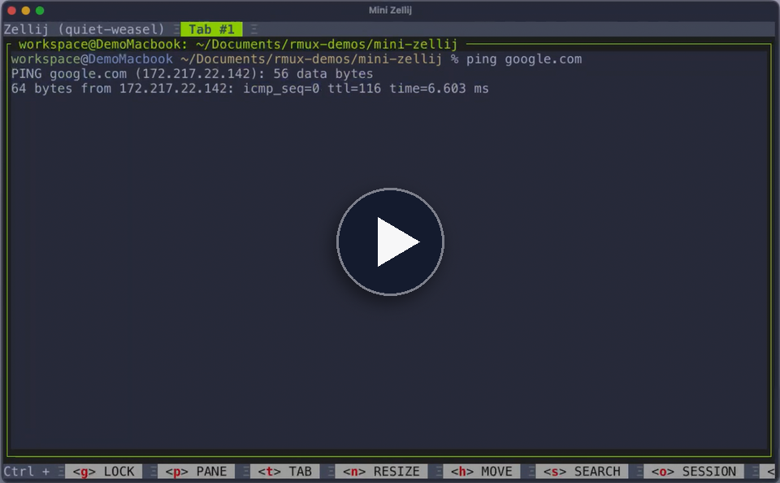

# rmux 演示

这里有五个小演示，用来展示 rmux 作为可编程终端后端的能力。

`rmux` 二进制必须已安装，并且在 `PATH` 中可用。

## Safety Warning

> [!WARNING]
> For testing purposes, some demos start AI CLIs with approval or sandbox bypass flags. Be careful with the commands you run, and only use these demos in directories you trust.

## 演示

下面是几个简短演示，展示你可以用 RMUX 构建什么。RMUX 打开了一类新的终端原生工作流，尤其适合*多智能体编排*。这里还缺一个演示：你的项目。如果你用 RMUX 做出了有趣的东西，欢迎提交 pull request，把它加到这里。

<!-- rmux-demo-gallery:start -->
<!-- rmux-demo-gallery-item:start -->
<p>
  <a href="https://github.com/Helvesec/rmux-demos/tree/main/demo-orchestration">
    <picture>
      <source media="(prefers-color-scheme: dark)" srcset="assets/readme/demo-orchestration-header-dark.svg">
      
    </picture>
  </a><br>
  <a href="https://rmux.io/#demo-orchestration">
    
  </a>
</p>
<!-- rmux-demo-gallery-item:end -->

<!-- rmux-demo-gallery-item:start -->
<p>
  <a href="https://github.com/Helvesec/rmux-demos/tree/main/broadcast-demo">
    <picture>
      <source media="(prefers-color-scheme: dark)" srcset="assets/readme/demo-broadcast-header-dark.svg">
      
    </picture>
  </a><br>
  <a href="https://rmux.io/#demo-broadcast">
    
  </a>
</p>
<!-- rmux-demo-gallery-item:end -->

<!-- rmux-demo-gallery-item:start -->
<p>
  <a href="https://github.com/Helvesec/rmux-demos/tree/main/mini-zellij">
    <picture>
      <source media="(prefers-color-scheme: dark)" srcset="assets/readme/demo-zellij-header-dark.svg">
      
    </picture>
  </a><br>
  <a href="https://rmux.io/#demo-zellij">
    
  </a>
</p>
<!-- rmux-demo-gallery-item:end -->

<!-- rmux-demo-gallery-item:start -->
<p>
  <a href="https://github.com/Helvesec/rmux-demos/tree/main/web-claude-demo">
    <picture>
      <source media="(prefers-color-scheme: dark)" srcset="assets/readme/demo-mirroring-header-dark.svg">
      
    </picture>
  </a><br>
  <a href="https://rmux.io/#demo-mirroring">
    
  </a>
</p>
<!-- rmux-demo-gallery-item:end -->

<!-- rmux-demo-gallery-item:start -->
<p>
  <a href="https://github.com/Helvesec/rmux-demos/tree/main/terminal-playwright-demo">
    <picture>
      <source media="(prefers-color-scheme: dark)" srcset="assets/readme/demo-playwright-header-dark.svg">
      
    </picture>
  </a><br>
  <a href="https://rmux.io/#demo-playwright">
    
  </a>
</p>
<!-- rmux-demo-gallery-item:end -->
<!-- rmux-demo-gallery:end -->

## 演示目录

- `broadcast-demo`：用一个 prompt 让多个 AI CLI 同时竞速。
- `mini-zellij`：一个由 rmux 驱动的小型 Zellij 风格工作区。
- `web-claude-demo`：浏览器和终端连接到同一个 pane。
- `demo-orchestration`：Claude 通过 rmux 控制 Codex、Gemini 和 Grok。
- `terminal-playwright-demo`：面向终端应用的 Playwright 风格测试。

## Rust 演示

在对应演示目录中运行：

```bash
cargo run -- check
cargo run
cargo run -- cleanup
```

## Orchestration 演示

Linux 和 macOS：

```bash
cd demo-orchestration
./launch.sh check
./launch.sh
./launch.sh cleanup
```

Windows PowerShell：

```powershell
cd demo-orchestration
.\launch.ps1 check
.\launch.ps1
.\launch.ps1 cleanup
```
