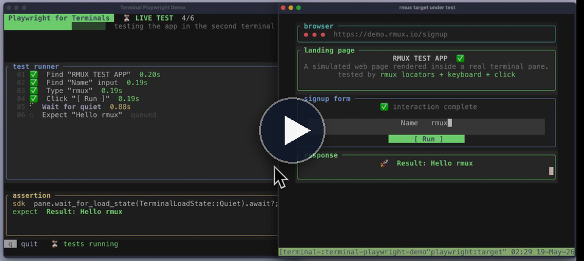

# terminal-playwright-demo

<!-- rmux-demo-media:start -->
<p>
  <a href="https://github.com/Helvesec/rmux-demos/tree/main/terminal-playwright-demo">
    <picture>
      <source media="(prefers-color-scheme: dark)" srcset="../assets/readme/demo-playwright-header-dark.svg">
      
    </picture>
  </a><br>
  <sub><em>≃ 1,495 lines</em></sub><br>
  <a href="https://rmux.io/#demo-playwright">
    
  </a>
</p>
<!-- rmux-demo-media:end -->

面向真实终端应用的 Playwright 风格测试。

demo 会打开两个终端：一个显示实时动画测试 runner，另一个显示在真实 rmux pane 中渲染的 simulated web page。

## 要求

`PATH` 中必须可用 `rmux`。

## 运行

```bash
cargo run -- check
cargo run -- smoke
cargo run
```

runner 会输入 `rmux`，点击 `[ Run ]`，等待终端进入 quiet 状态，然后断言：

```text
Result: Hello rmux
```

## 清理

```bash
cargo run -- cleanup
```
