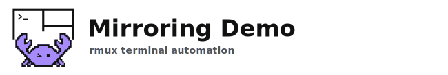
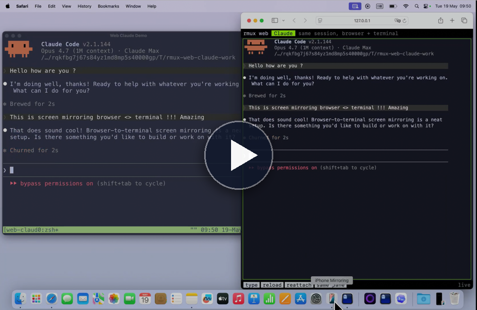

# web-claude-demo

<!-- rmux-demo-media:start -->
<p>
  <a href="https://github.com/Helvesec/rmux-demos/tree/main/web-claude-demo">
    <picture>
      <source media="(prefers-color-scheme: dark)" srcset="../assets/readme/demo-mirroring-header-dark.svg">
      
    </picture>
  </a><br>
  <a href="https://rmux.io/#demo-mirroring">
    
  </a>
</p>
<!-- rmux-demo-media:end -->

Un navigateur et un terminal attaches au meme pane rmux.

La demo lance un petit bridge WebSocket. Tape dans le navigateur ou dans le terminal: les deux vues restent synchronisees.

## Prerequis

- `rmux` dans le `PATH`
- `claude` dans le `PATH`, ou `RMUX_WEB_CMD` configure vers une autre commande

## Warning securite

> [!WARNING]
> For testing purposes, the default Claude command uses approval or sandbox bypass flags. Be careful with the commands you run, and only use this demo in directories you trust.

## Lancer

```bash
cargo run -- check
cargo run
```

Ouvre:

```text
http://127.0.0.1:8080
```

Pour un telephone sur le meme Wi-Fi, utilise l'IP locale de ta machine.

## Options

```bash
RMUX_WEB_CMD='IS_DEMO=1 claude --dangerously-skip-permissions --permission-mode bypassPermissions || exec bash'
PORT=8080
```

## Nettoyage

```bash
cargo run -- cleanup
```
